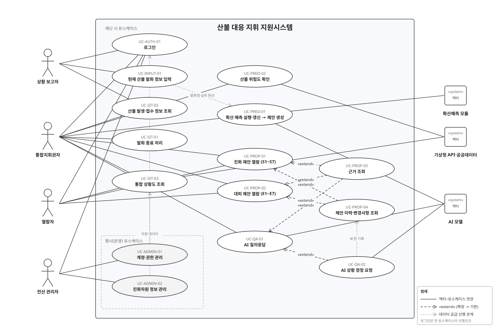

# 산불 대응 AI 의사결정 지원 시스템 — 시연 목업 요구사항 명세 (확정 유스케이스 기준)

- 대상: 이 저장소의 정적 웹 목업(`index.html`, `app.js`, `data*.js`). 확산 예측 결과를 표준매뉴얼 근거와 연결해 통합지휘권자에게 진화·대피 조치를 제안하는 의사결정 지원 화면.
- 기준 문서: 「확정 유스 케이스 식별자 목록」(15개 UC), 「확정 기능 요구사항 목록」(32개 기능 + 제외 기능표). 이 README의 ID는 그 문서와 같다.
- 시연 시나리오: 2025-03-22 경북 의성군 안평면 괴산리 산불, 기준시각(t0) 12:00, 발생 후 8시간(1시간 간격 P1~P8).
- 열어 보기: `index.html`을 정적 서버로 열거나(예: `python -m http.server`) GitHub Pages 주소로 접속. 온라인 필요(지도 타일).
- 시연 계정(비밀번호 `1234`): `cmd01` 통합지휘권자 · `view01` 열람자 · `rep01` 상황 보고자 · `admin01` 전산 관리자. 로그인 화면에서 사용자 구분을 바꾸면 그 구분의 시연 계정이 자동으로 채워진다. 아이디·비밀번호·구분이 발급 계정과 맞지 않으면 진입하지 않는다.
- 표기: 각 기능의 **상태** 열은 목업에서 실제로 계산·동작하면 「동작」, 미리 정한 값·대본으로 흉내내면 「연출」, 실서비스에서 다른 구성요소로 바뀌면 괄호에 적었다.
- 화면 구성은 산림청 산불상황관제시스템·GPS단말기 로그인·항공기 위치추적 화면을 참고했다. 화선은 합성 모델이고 일부 값은 가상이다(부록 A).

---

## 1. 시스템 정의와 액터

### 1.1 정의

산불이 접수되면 ① 상황 보고자가 발화 위치·발생 일시와 현재 진행된 실제 화선을 폴리곤으로 입력하고, ② 통합지휘권자가 확산 예측을 실행하면 시스템이 1시간 단위 확산 범위(P1~P8)와 위험구역(5h)·잠재 위험구역(8h)을 산출한 뒤 규칙 판정과 AI 생성으로 진화(S1~S7)·대피(E1~E7) 대응 제안서를 만들며, ③ 통합지휘권자와 열람자가 통합 상황도·제안·근거·이력을 보고, ④ 통합지휘권자는 AI 어시스턴트로 질의하거나 상황 변화를 정정해 제안을 다시 생성하고, 진화가 끝나면 종료 처리하는 웹 시스템. 평시에는 전산 관리자가 계정과 진화자원 데이터를 관리한다.

### 1.2 액터

| 액터 | 종류 | 권한 | 목업에서 쓰는 화면 |
|---|---|---|---|
| 통합지휘권자 | 사람(주 액터) | 조작 + 열람. 조작은 데이터·상황을 바꾸는 동작(종료 처리, 예측 실행, 상황 정정) | 지도 + 상황정보 창(산불현황·확산예측·대응제안·이력), 진화자원 창, AI 어시스턴트 |
| 열람자 | 사람 | 열람만. 레이어 켜기·재생·탭 전환 같은 화면 보기 동작은 열람에 포함 | 통합지휘권자와 같은 화면에서 예측 실행·종료·AI 어시스턴트·제안 다시 생성이 숨김 |
| 상황 보고자 | 사람 | 초기 산불의 발화 위치·발생 일시와 실제 화선 폴리곤 입력, 산불 목록 조회 | 지도 + 발화 정보 입력 창 |
| 전산 관리자 | 사람 | 평시 계정·권한 관리, 진화자원 정보 관리 | 관리 화면(지도 없음) |
| 확산예측 모듈 | 시스템 | 발화점·실측 화선·기상으로 P1~P8 산출(목업은 합성 타원 모델, 실서비스는 ELMFIRE) | UC-PRED-01 |
| AI 모델 | 시스템 | 예측 폴리곤과 상황값으로 제안문 생성, 질의응답, 정정 해석(목업은 규칙 템플릿·키워드 대본, 실서비스는 EXAONE + RAG) | UC-PRED-01, UC-QA-01, UC-QA-02 |
| 기상청 API·공공데이터 | 시스템 | 기상 관측·예보, 마을·시설·도로·경계 데이터(목업은 고정값·OSM·SGIS 파일) | UC-SIT-03, UC-PRED-02 |

- 확정 문서의 UC-AUTH-01 액터 목록에는 상황 보고자가 없지만, 목업은 상황 보고자도 발급 계정으로 로그인하는 것으로 두었다(입력 주체를 기록하기 위함).
- 책임자의 직위·관할(군수, 경상북도 › 의성군 › 안평면)은 화면에 표시하지 않는다(제외 기능 2번). 상단에는 아이디와 사용자 구분만 보인다.

### 1.3 화면 구성

| 영역 | 내용 | 관련 UC |
|---|---|---|
| 로그인 화면 | 정부 상징·산림청·시스템명 헤더(현재 시각 KST), 소개 패널, LOGIN 폼(아이디·비밀번호·사용자 구분), 시연 계정 안내, 공지사항 | UC-AUTH-01 |
| 상단 1줄 | 시스템명, 현재 시각(서버 시각, KST) 시계, 「진화자원」 창 토글, 빨간 메뉴(산불현황·확산예측·대응제안·제안이력), 사용자(아이디 · 구분)·로그아웃. 상황정보 창 헤더의 시계는 시연 시나리오 시각(재생 시각)이라 서로 다르다 | UC-SIT-02·03, UC-PRED-01, UC-PROP-01~04 |
| 상단 2줄 | 레이어 버튼을 예측(화선·위험구역) / 인구(마을·주택) / 시설(취약시설·국가유산·대피소·담수지·송전선) / 도로(도로·철도·대피로) / 기관(유관기관·진화대·읍면경계)으로 묶음 | UC-SIT-03 |
| 지도 | 위성영상(Esri) + 지명·도로 라벨(OpenFreeMap), 실측 화선(진홍), 예측 화선·위험구역, 아이콘 마커, 우측 도구줄(확대·축소·범위 맞춤·위성/일반), 세로 탭(산불·범례), 나침반·좌표 | UC-SIT-03, UC-INPUT-01 |
| 상황정보 창(우측, 이동 가능) | 헤더(재생 시각·산불명), 발생 장소·신고·진행상태·단계 표, 탭 4개: 산불현황 / 확산예측 / 대응제안 / 이력 | UC-SIT-01·02·03, UC-PRED-01·02, UC-PROP-01~04 |
| 발화 정보 입력 창(상황 보고자) | 산불 목록, 산불명·주소·발화 위치(지도 지정)·발생 일시·신고 접수 일시·신고 내용, 실측 화선 폴리곤(지도에서 그리기 / GeoJSON 붙여넣기), 저장 | UC-INPUT-01, UC-SIT-02 |
| 떠 있는 창 | 진화자원 현황(좌), 범례(우), AI 어시스턴트 팝업(우측 하단 버튼), 근거 창(상황정보 창 위), 모달(종료 처리 확인·정정 확인·제안 변경사항·GeoJSON) | UC-SIT-03, UC-PROP-03·04, UC-QA-01·02 |
| 관리 화면(전산 관리자) | 헤더(현재 시각 KST·로그아웃), 계정·권한 관리 표(발급·회수·권한 변경·삭제·신규 발급), 진화자원 정보 관리 표(등록·수정·삭제) | UC-ADMIN-01·02 |

---

## 2. 기능 요구사항과 목업 구현

번호는 「확정 기능 요구사항 목록」의 순서를 따른다.

| 구분 | 기능 | 목업 구현 | 화면 위치 | UC | 상태 |
|---|---|---|---|---|---|
| 인증·권한 | 로그인·계정·권한 관리 | 아이디·비밀번호·사용자 구분을 계정 목록과 대조해 모두 맞을 때만 진입. 틀리면 「잘못된 아이디 또는 비밀번호입니다」 토스트, 회수 계정이면 거부. 구분을 바꾸면 시연 계정 자동 채움. 관리자가 계정(비밀번호 포함) 발급·회수·권한 변경 | 로그인 화면, 관리 화면 | UC-AUTH-01, UC-ADMIN-01 | 동작(계정 검증은 목록 대조. 실서비스는 인증 서버) |
| 자원 데이터 관리 | 진화자원 정보 관리 | 헬기·차량·인력 단위를 구분·명칭·소속·수량·상태(투입·대기·정비)로 등록·수정·삭제. 값이 재난 시 자원 현황과 S3 제안에 반영 | 관리 화면 | UC-ADMIN-02 | 동작(메모리 안에서만 유지) |
| 상황 파악 | 실제 산불 정보 입력(설정) | 산불 목록에서 선택하거나 「새 산불」로 산불명·주소·발화 위치(지도 클릭 또는 좌표)·발생 일시·신고 접수 일시·신고 내용 입력, 실제 화선을 지도에서 꼭짓점을 찍어 그리거나 GeoJSON Polygon으로 입력. 저장하면 목록에 반영되고 면적(ha)이 계산되며, 이미 예측이 있으면 「재예측 필요」 표시 | 발화 정보 입력 창 | UC-INPUT-01 | 동작 |
| 시스템 | 이벤트 로그 | 로그인·로그아웃·발화 정보 입력·예측·제안 생성·정정·종료를 시각·구분·내용·사용자로 기록 | 이력 탭 하단(열람) | — | 동작 |
| 상황 파악 | 발화 종료 처리 | 「진화 완료 · 종료 처리」 → 확인 창 → 종료 상태·종료 시각·진화율 100%. 이후 예측·정정 중단, 제안은 이력으로만 열람 | 산불현황 탭 | UC-SIT-01 | 동작 |
| 상황 파악 | 산불 발생·접수 정보 조회 | 산불 목록(진행 중·접수가 기본, 「종료 포함」 체크로 종료 표시)에서 선택 → 발생 장소·발화 위치·발생 일시·신고 접수·신고 내용·접수 기관별 시각·진행상태·공식 단계·실측 화선 면적·진화율 | 산불현황 탭 | UC-SIT-02 | 동작(접수 기관 시각은 시연값) |
| 상황 파악 | 통합 상황지도 | 발화점·실측 화선·예측 화선(재생 시각까지 채움, 다음 1시간 점선)·위험구역(5h)·잠재 위험구역(8h)과 마을·시설·도로·기관을 한 지도에 표시 | 지도 | UC-SIT-03 | 동작 |
| 상황 파악 | 지도 레이어 선택 | 인구·시설·도로·기관 묶음별 버튼으로 켜고 끔(기상·지형·연료 레이어 없음) | 상단 2줄 | UC-SIT-03 | 동작 |
| 상황 파악 | 주요 시설 지도 표시 | 마을·취약시설·국가유산·대피소·담수지·유관기관·진화대 아이콘을 발화점·확산 범위와 같은 지도에 표시. 마커를 누르면 이름·종류만 팝업(인구·연락처 같은 상세 정보 없음). 발화점 거리 라벨·거리표시 토글은 두지 않음 | 지도 | UC-SIT-03 | 동작 |
| 상황 파악 | 진화자원 현황 조회 | 헬기·차량·인력별 보유·투입·대기·가용 집계와 단위별 표(투입 초록, 대기 노랑). 관리자 등록값과 AI 정정(헬기 N대 투입 등)이 반영 | 상단 「진화자원」 → 좌측 창 | UC-SIT-03 | 연출(자원 수·호출부호 가상) |
| 상황 파악 | 시간별 확산 확인 | 재생·정지·슬라이더·속도(1×·2×·4×)로 t0~+8h 전개. 표시 시각이 상황정보 창 시계와 연동, 야간이면 표시. 화선이 닿은 마을 아이콘 빨강, 8h 범위 안 대피소 빨강 | 확산예측 탭 재생줄 | UC-SIT-03 | 동작 |
| 확산 예측 | 확산 예측 실행·갱신 | 발화점·t0·기상·실측 화선으로 P1~P8 산출(실측 폴리곤을 포함하도록 방사 방향으로 확장). 진행 단계 표시 후 5h·8h 면적과 주 방향 표시, 규칙 판정과 진화·대피 제안 생성. 「다시 예측」으로 갱신 | 확산예측 탭 | UC-PRED-01 | 연출(합성 타원 모델. 실서비스는 ELMFIRE) |
| 확산 예측 | 산불 위험도 조회 | 발화 지점의 조건위험도 0~100 = 25 × (4요인 점수 가중평균 − 1). 요인은 기상(0.35)·지형(0.30)·연료(0.25)·인프라(0.10), 점수 1~5. 등급(낮음 0~50·보통 51~65·높음 66~85·매우 높음 86~100)과 요인 막대(점수/5 · 가중치), 결측 변수 목록 | 확산예측 탭 | UC-PRED-02 | 연출(요인 점수는 시연값 4.2·3.6·3.9·2.4 → 69.1 높음. 실서비스는 25개 변수) |
| 대응 제안 | 대응 제안 생성·갱신·상세 조회 | 예측 완료·상황 정정·「제안 다시 생성」에서 새 판 생성. 항목을 펼치면 제안 문장, 판정 이유, 대상, 권한, 충돌, 근거 | 대응제안 탭 | UC-PRED-01, UC-PROP-01·02 | 동작(판정) / 연출(문장 템플릿. 실서비스는 EXAONE + RAG) |
| 대응 제안 | 제안 분류 | 진화 제안(S1~S7) / 대피 제안(E1~E7) 탭과 즉시·대기·협의·요청 필터, 구분별 건수. 해당 없는 항목은 「해당 없음 N건 보기」 뒤에 접힘 | 대응제안 탭 | UC-PROP-01·02 | 동작 |
| 대응 제안(진화) | S1 대응단계 판단·격상 검토 | 5h 예상 면적으로 판정 단계를 정해 공식 단계와 비교. 높으면 「협의」로 격상 검토 권고와 지휘권 인계 안내(제안 상단 배너) | 대응제안 탭 | UC-PROP-01 | 동작(면적 기준만 적용) |
| 대응 제안(진화) | S2 진화 우선지역·보호대상 선정 | P5 내 인명(마을·취약시설) → 국가유산·송전선 → 주택 순 | 〃 | 〃 | 동작 |
| 대응 제안(진화) | S3 진화자원 투입·배분·재배치 | 주 확산 방향 구역 우선 배치, 가용 헬기 집중 투입. 추가 헬기 대수는 「근거 부족」 문장 | 〃 | 〃 | 동작 |
| 대응 제안(진화) | S4 진화 방식·시간대 전략 | 현재 풍속의 헬기 운용 가능 여부, 최대 풍속 시간대, 일몰 후 집중 진화 | 〃 | 〃 | 동작 |
| 대응 제안(진화) | S5 시설 보호 조치 | P5 내 주택군 소방차 배치·예비 살수, 송전선 통과 시 한전 요청 | 〃 | 〃 | 동작 |
| 대응 제안(진화) | S6 유관기관 동원·협조 요청 | 걸친 시·군·구 수와 지휘권 변경, 인접 시·군·소방·경찰·군 동원 요청 | 〃 | 〃 | 동작 |
| 대응 제안(진화) | S7 진화인력 안전·투입 관리 | P5 내 작업 조 수, 풍상측 퇴로, 최대 풍속 시간대 전방 투입 제한 | 〃 | 〃 | 동작 |
| 대응 제안(대피) | E1 위험구역 설정 | 화선 도달 ≤5h 마을 위험구역(즉시), ≤8h 잠재 위험구역(대기) | 〃 | UC-PROP-02 | 동작 |
| 대응 제안(대피) | E2 대피 대상·순서·시점 결정 | 도달 시각·고령자 순 대피 순위, 야간 도달 마을 일몰 전 사전대피, 대피 완료 마을 제외, 명령 발령 후 미대피 확인 | 〃 | 〃 | 동작 |
| 대응 제안(대피) | E3 취약시설·미대피 주민 조치 | 확산 범위 내 취약시설 별도 이송, 미대피 주민 강제 대피 | 〃 | 〃 | 동작 |
| 대응 제안(대피) | E4 대피소 배정·분산 | 8h 범위 밖 대피소에 마을 인구를 최근접 순 배정, 수용 초과 시 분산, 범위 안 대피소 제외 | 〃 | 〃 | 동작 |
| 대응 제안(대피) | E5 대피 경로·교통통제 | 대피로·진입로 겹침 구간 경찰 통제 요청, 겹침 구간 화선 도달 시각 | 〃 | 〃 | 동작(겹침 구간은 시나리오 고정) |
| 대응 제안(대피) | E6 재난문자·방송 전파 제안 | 확산 범위 읍면동에 대피 명령 단계 CBS·DITS 송출, 송출 이력 반영 | 〃 | 〃 | 동작 |
| 대응 제안(대피) | E7 인명구조·긴급구조 요청 | 부상·고립 보고가 있으면 소방 긴급구조통제단 요청 | 〃 | 〃 | 동작 |
| 대응 제안 | 대응 근거 조회 | 문장 속 번호나 근거 목록의 [k]를 누르면 근거 창에 해당 문장과 표준매뉴얼 문서·쪽·절·요약 청크 표시 | 대응제안 탭 → 근거 창, AI 답변 | UC-PROP-03 | 동작(청크는 쪽수 기준 요약) |
| 대응 제안 | 제안 이력·변경사항 조회 | 판별 생성 시각·사유·구분 건수·변경 건수 표. 「보기」로 이전 판 열람(「이전 판」 배지, 「최신 판으로」), 「비교」로 이전 판과 달라진 항목을 전후 문장으로 비교 | 이력 탭, 모달 | UC-PROP-04 | 동작 |
| 질의응답 | AI 질의응답 | 대피 순서·대피소·헬기·격상·위험도·야간·송전선·재난문자·교통통제·취약시설·자원·현재 상황·근거 질문에 상황값을 넣어 하십시오체로 답하고 근거 번호를 붙임. 빠른 질문 6개. 항목의 「이 항목 질문」으로 컨텍스트 지정 | AI 어시스턴트 팝업 | UC-QA-01 | 연출(키워드 대본. 실서비스는 EXAONE + RAG) |
| 질의응답 | AI 상황 정정 요청 | 「박곡리 대피 완료」「헬기 6대 투입」「소방차 12대 투입」「진화인력 4개 조 투입」「진화율 30%」「예상 진화시간 6시간」「대피명령 발령」「안평면 재난문자 송출」「확산대응 1단계 발령」「위기경보 경계」 같은 발화를 변경안 표로 확인받아 저장하고, 예측은 그대로 둔 채 제안을 재생성해 변경사항 창을 띄움 | AI 어시스턴트 팝업 → 확인 모달 | UC-QA-02 | 동작(해석은 정규식) |

### 2.1 제외된 기능과 목업에서 뺀 것

| 제외 기능(번호) | 이전 목업에 있던 것 | 이번 개편 |
|---|---|---|
| 2 책임자·관할 표시 | 상단 「의성군수 · 통합지휘본부장」, 관할 경로, 상황정보 창 지휘 칸 | 제거. 아이디·사용자 구분만 표시 |
| 6 조치 상태·이력 관리 | 현장 보고 입력 모달 | 제거. 상황 변화는 AI 상황 정정 요청으로만 반영 |
| 9 기상·지형·연료 레이어 | 일반지도 음영기복 | 제거. 인구·시설·도로·기관 묶음만 유지 |
| 10 마을·시설·유관기관 정보 조회 | 마을 팝업의 인구·고령·배정 대피소, 담당자 연락처 모달 | 제거. 팝업은 이름·종류만 |
| 11 주변 시설·거리 조회 | 상황정보 탭 근접 시설 표·반경 선택, 지도 위 발화점 거리 라벨·거리표시 토글 | 제거. 시설은 위치 아이콘으로만 표시 |
| 13 상세 기상·주야간 정보 조회 | 기상정보 창, 헤더 풍향·풍속·일출·일몰 칸 | 제거. 기상값은 예측·위험도·S4 전략의 입력으로만 |
| 20 예측 결과·도달 예상 요약 | KPI 상자, 마을별 도달 예상 표 | 제거. 위험구역 마을과 도달 시각은 E1·E2 안에서 확인 |
| 21 3D 지형·건물 | 3D 버튼, 지형·건물 레이어 | 제거 |
| 25 정보 부족·예외 상태 표시 | 근거 부족·정보 부족 배지, 요약의 근거 부족 수 | 배지 제거. 문장 안 「근거 부족」 표기는 유지 |
| 26 제안과 지도 연결 | 막대 위 마우스 올림 강조, 「지도」 버튼, 팝업의 「대피 제안 보기」 | 제거 |
| 28 제안 채택·보류·수정 지시 | 채택·보류·수정 버튼, 브라우저 저장, 결정 수 | 제거 |
| 45 상황기록 조회 | 하단 도크, 실제 경과 표시 | 제거. 이벤트 로그는 이력 탭에 목록으로만 |
| 46 이벤트 알림 설정 | 알림 토글 | 제거(동작 결과 안내 토스트만 남김) |
| 47 정보 출처 조회 | 데이터 출처 모달, 가상값 점선 밑줄 | 제거. 출처는 지도 귀속 표시와 부록 A로만 |
| (UC v3에만 있던) 조건 변경 시뮬레이션 | 풍속·풍향 what-if | 확정 목록에 없어 제거 |
| (이전 목업) 검색 | 마을·시설 검색창 | 확정 목록에 없어 제거 |

---

## 3. 유스케이스 다이어그램

### 3.1 관계

| 관계 | 기본 유스케이스 | 확장 유스케이스 | 뜻 |
|---|---|---|---|
| «extend» | UC-PROP-01 진화 제안 열람, UC-PROP-02 대피 제안 열람 | UC-PROP-03 근거 조회 | 열람 중 [k]를 누를 때만 |
| «extend» | UC-PROP-01, UC-PROP-02 | UC-PROP-04 제안 이력·변경사항 조회 | 열람 중 이력 탭으로 갈 때만 |
| «extend» | UC-QA-01 AI 질의응답 | UC-PROP-03 근거 조회 | 답변의 [k]를 누를 때만 |
| «extend» | UC-QA-01 AI 질의응답 | UC-QA-02 AI 상황 정정 요청 | 발화가 상황 변화로 판정될 때만. 확정 시 새 제안 판이 생겨 UC-PROP-04 이력에 기록 |
| 데이터 공급·선행 | UC-INPUT-01 → UC-PRED-01 | — | 발화점·실측 화선이 예측 입력 |
| 데이터 공급 | UC-ADMIN-01 → UC-AUTH-01, UC-ADMIN-02 → UC-SIT-03(자원 현황)·S3 | — | 평시 데이터가 재난 시 화면의 공급원 |

- 로그인(UC-AUTH-01)은 모든 유스케이스의 선행조건이라 화살표 대신 각 시나리오의 선행조건에 적었다.
- 제안 생성은 UC-PRED-01 안에 포함되어 있어 별도 유스케이스로 두지 않는다. 진화(S1~S7)와 대피(E1~E7) 열람은 두 판단 축을 드러내기 위해 UC를 나눴다.
- 통합지휘권자는 기본 유스케이스에만 연관선을 그었다. 확장 유스케이스는 기본 유스케이스의 액터가 그대로 참여한다.

### 3.2 식별자 목록

| UC ID | 유스케이스 | 액터 | 목업 화면 | 관계 |
|---|---|---|---|---|
| UC-AUTH-01 | 로그인 | 통합지휘권자, 열람자, 상황 보고자, 전산 관리자 | 로그인 화면 | 전 UC 선행조건 |
| UC-INPUT-01 | 현재 산불 발화 정보 | 상황 보고자 | 발화 정보 입력 창 | UC-PRED-01·02 선행 |
| UC-SIT-01 | 발화 종료 처리 | 통합지휘권자 | 산불현황 탭 | — |
| UC-SIT-02 | 산불 발생·접수 정보 조회 | 통합지휘권자, 상황 보고자 | 산불현황 탭, 입력 창 목록 | — |
| UC-SIT-03 | 통합 상황도 조회 | 통합지휘권자, 열람자, 기상청 API·공공데이터 | 지도, 레이어, 재생줄, 진화자원 창 | — |
| UC-PRED-01 | 확산 예측 실행·갱신 → 대응 제안 생성 | 통합지휘권자, 확산예측 모듈, AI 모델 | 확산예측 탭 | 제안 생성 포함 |
| UC-PRED-02 | 산불 위험도 확인 | 통합지휘권자, 기상청 API·공공데이터 | 확산예측 탭 | — |
| UC-PROP-01 | 진화 제안 열람 (S1~S7) | 통합지휘권자, 열람자 | 대응제안 탭 | PROP-03·04가 확장 |
| UC-PROP-02 | 대피 제안 열람 (E1~E7) | 통합지휘권자, 열람자 | 대응제안 탭 | PROP-03·04가 확장 |
| UC-PROP-03 | 근거 조회 | 통합지휘권자, 열람자 | 근거 창 | PROP-01·02·QA-01 확장 |
| UC-PROP-04 | 제안 이력·변경사항 조회 | 통합지휘권자, 열람자 | 이력 탭, 변경사항 모달 | PROP-01·02 확장 |
| UC-QA-01 | AI 질의응답 | 통합지휘권자, AI 모델 | AI 어시스턴트 팝업 | PROP-03·QA-02가 확장 |
| UC-QA-02 | AI 상황 정정 요청 | 통합지휘권자, AI 모델 | 팝업 → 정정 확인 모달 | QA-01 확장 |
| UC-ADMIN-01 | 계정·권한 관리 | 전산 관리자 | 관리 화면 | AUTH-01 계정 공급 |
| UC-ADMIN-02 | 진화자원 정보 관리 | 전산 관리자 | 관리 화면 | SIT-03·S3 데이터 공급 |

---

## 4. 유스케이스 시나리오

공통: 모든 유스케이스의 선행조건에 「UC-AUTH-01 로그인 완료」가 들어간다. 아래에는 그 외 조건만 적는다.

### UC-AUTH-01 로그인

| 항목 | 내용 |
|---|---|
| 개요 | 발급받은 계정으로 인증하고 권한(조작·열람·입력·관리)에 맞는 화면에 진입한다. 회원가입은 없다. |
| 행위자 | 통합지휘권자, 열람자, 상황 보고자, 전산 관리자 |
| 선행조건 | 로그인 화면이 열려 있다. |
| 후행조건 | 권한에 맞는 화면이 열리고 이벤트 로그에 로그인이 남는다. |

기본 흐름
1. 로그인 화면이 헤더, 소개 패널, LOGIN 폼, 시연 계정 안내, 공지사항을 표시한다.
2. 사용자가 사용자 구분을 고른다. 시스템이 그 구분의 시연 계정 아이디·비밀번호를 자동으로 채운다(목업 편의).
3. 사용자가 필요하면 아이디·비밀번호를 고치고 「로그인」을 누르거나 Enter를 친다.
4. 시스템이 계정 목록과 아이디·비밀번호·구분을 대조해 모두 맞으면 권한을 정한다. 통합지휘권자·열람자는 지도와 상황정보 창의 「산불현황」 탭, 상황 보고자는 지도와 발화 정보 입력 창, 전산 관리자는 관리 화면을 연다.
5. 시스템이 이벤트 로그에 로그인을 기록한다.

대안 흐름
- A-1 (4단계) 열람자로 진입했을 때 예측이 없으면 시스템이 예측·제안을 자동으로 만들어 읽기 전용으로 보여준다(통합지휘권자가 이미 실행한 상황을 흉내냄).
- A-2 (4단계) 통합지휘권자로 진입했을 때 예측이 없으면 「확산예측 탭에서 확산 예측 실행을 누르십시오」 안내가 뜬다.

예외 흐름
- E-1 (3단계) 아이디를 비우면 「아이디를 입력하십시오」를 표시한다.
- E-2 (4단계) 아이디가 없거나 비밀번호가 틀리거나 계정 권한과 사용자 구분이 다르면(예: `view01`에 통합지휘권자 선택) 「잘못된 아이디 또는 비밀번호입니다」 토스트가 떴다 사라지고 진입하지 않는다.
- E-3 (4단계) 회수된 계정이면 「회수된 계정입니다」를 표시하고 진입하지 않는다.
- E-4 (언제든) 로그아웃하면 재생과 입력 모드를 멈추고 로그인 화면으로 돌아간다. 상황·예측·제안은 브라우저 페이지가 살아 있는 동안 유지되어 다른 계정으로 다시 로그인하면 이어서 볼 수 있다.

### UC-INPUT-01 현재 산불 발화 정보

| 항목 | 내용 |
|---|---|
| 개요 | 초기 산불의 발화 위치와 발생 일시를 입력하고, 현재 진행된 실제 산불 범위를 폴리곤으로 입력한다. |
| 행위자 | 상황 보고자 |
| 선행조건 | 사용자 구분이 상황 보고자다. |
| 후행조건 | 산불 목록에 반영되고(신규는 「진행 중」, 접수 건은 「진행 중」으로 전환) 실측 화선 면적이 계산된다. 이벤트 로그에 남는다. 해당 산불에 예측이 있으면 「재예측 필요」가 표시된다. |

기본 흐름
1. 시스템이 발화 정보 입력 창에 산불 목록과 선택한 산불의 값을 채운 입력 폼을 표시한다.
2. 사용자가 목록에서 산불을 고르거나 「새 산불」을 누른다.
3. 사용자가 산불명·발생 장소를 입력하고 「지도에서 발화 위치 지정」을 누른 뒤 지도를 눌러 발화 위치를 찍는다(좌표 직접 입력도 가능).
4. 사용자가 발생 일시·신고 접수 일시·신고 내용을 입력한다.
5. 사용자가 「지도에서 그리기」를 누르고 지도를 눌러 꼭짓점을 차례로 찍은 뒤 「그리기 완료」를 누른다. 시스템이 꼭짓점 수와 면적(ha)을 표시한다.
6. 사용자가 「저장」을 누른다.
7. 시스템이 값을 검증하고 산불을 저장·갱신한 뒤 지도를 그 산불로 옮기고 이벤트를 기록한다.

대안 흐름
- A-1 (5단계) 「GeoJSON 붙여넣기」로 Polygon(또는 Feature/FeatureCollection의 첫 Polygon) 좌표를 넣어 적용한다.
- A-2 (5단계) 「지우기」로 폴리곤을 비우고 저장하면 기존 폴리곤은 유지된다(폴리곤 없이 위치·일시만 갱신).
- A-3 (2단계) 「종료 포함」을 켜면 종료된 산불도 목록에 보이지만 수정할 수 없다.
- A-4 (3·5단계) Esc를 누르면 위치 지정·그리기 모드를 취소한다.

예외 흐름
- E-1 (7단계) 산불명·발생 장소·발화 위치·발생 일시가 비면 어떤 항목이 필요한지 안내하고 저장하지 않는다.
- E-2 (7단계) 좌표가 국내 범위(경도 124~132, 위도 33~39)를 벗어나면 저장하지 않는다.
- E-3 (A-1) GeoJSON 해석에 실패하면 이유를 표시하고 창을 닫지 않는다.

### UC-SIT-01 발화 종료 처리

| 항목 | 내용 |
|---|---|
| 개요 | 진화가 끝난 산불을 종료 상태로 전환한다(사건 끝). 발화 위치·일시 지정은 상황 보고자(UC-INPUT-01)가 맡는다. |
| 행위자 | 통합지휘권자 |
| 선행조건 | 선택한 산불이 종료 상태가 아니다. |
| 후행조건 | 진행상태 「종료」, 종료 시각, 진화율 100%. 예측 실행·상황 정정·제안 재생성이 막히고 제안은 이력으로만 열람한다. 목록에서는 「종료 포함」을 켜야 보인다. |

기본 흐름
1. 사용자가 「산불현황」 탭에서 「진화 완료 · 종료 처리」를 누른다.
2. 시스템이 종료 시각·진화율 변화·영향을 확인 창에 보인다.
3. 사용자가 「종료 처리」를 누른다.
4. 시스템이 상태를 바꾸고 재생을 멈추며 이벤트를 기록하고 화면을 갱신한다.

대안 흐름
- A-1 (3단계) 「취소」를 누르면 아무것도 바뀌지 않는다.

예외 흐름
- E-1 (1단계) 열람자에게는 버튼이 보이지 않는다.

### UC-SIT-02 산불 발생·접수 정보 조회

| 항목 | 내용 |
|---|---|
| 개요 | 산불 목록에서 선택해 발생 장소·신고 내용·접수 시각·진행상태를 본다. 예측이 아닌 현재 상황 파악이다. |
| 행위자 | 통합지휘권자, 상황 보고자(열람자도 같은 탭을 읽을 수 있다) |
| 선행조건 | 산불이 1건 이상 등록되어 있다. |
| 후행조건 | 없음(선택한 산불이 현재 산불이 되고 지도가 이동한다). |

기본 흐름
1. 시스템이 「산불현황」 탭에 진행 중·접수 산불 목록(산불명·주소·접수 시각·상태)을 표시한다. 상황 보고자는 입력 창의 목록으로 본다.
2. 사용자가 행을 누른다.
3. 시스템이 그 산불을 현재 산불로 바꾸고 지도를 발화점으로 옮기며 발생 장소·발화 위치·발생 일시·신고 접수·신고 내용·접수 기관별 시각·진행상태·공식 단계·위기경보·실측 화선(면적·입력 시각·입력자)·진화율·예측 요약을 표시한다.
4. 상황정보 창 헤더에도 발생 장소·신고·진행상태·단계가 보인다.

대안 흐름
- A-1 (1단계) 「종료 포함」을 켜면 종료된 산불도 보인다. 현재 선택된 산불이 종료되면 체크와 관계없이 목록에 남는다.
- A-2 (3단계) 다른 산불로 바꾸면 각 산불의 예측·제안·이력이 따로 유지된다.

예외 흐름
- E-1 (3단계) 실측 화선이 없으면 「미입력 — 상황 보고자 입력 대기」가 보인다.

### UC-SIT-03 통합 상황도 조회

| 항목 | 내용 |
|---|---|
| 개요 | 지도 위에 나타나는 모든 정보를 본다. 발화점·실측 화선·예측 폴리곤(위험 5h·잠재 8h) 위에 레이어 토글, 시설 위치, 진화자원 현황, 시간 재생을 겹쳐 본다. |
| 행위자 | 통합지휘권자, 열람자. 보조: 기상청 API·공공데이터 |
| 선행조건 | 없음(예측 폴리곤은 UC-PRED-01 이후). |
| 후행조건 | 없음(표시 상태만 바뀐다). |

기본 흐름
1. 시스템이 위성영상 지도에 발화점, 실측 화선, 마을·취약시설·국가유산·대피소·담수지·유관기관 아이콘, 도로·철도·송전선·대피로·진입로, 읍면 경계를 표시한다.
2. 사용자가 상단 2줄 레이어 버튼(예측·인구·시설·도로·기관)으로 표시 항목을 켜고 끈다.
3. 사용자가 마커를 누르면 이름·종류 팝업이 뜬다.
4. 사용자가 상단 「진화자원」을 눌러 헬기·차량·인력의 보유·투입·대기·가용 집계와 단위별 표를 본다.
5. 예측이 있으면 사용자가 「확산예측」 탭의 재생줄로 t0~+8h 화선 전개를 재생하거나 슬라이더로 시각을 고른다. 표시 시각이 창 헤더 시계와 연동되고 야간이면 표시된다.
6. 사용자가 우측 도구줄로 확대·축소·범위 맞춤·위성/일반 전환을, 나침반으로 북쪽 맞춤을 한다. 세로 탭 「범례」로 범례 창을 연다.

대안 흐름
- A-1 (5단계) 화선이 닿은 마을 아이콘은 빨간색, 8h 범위 안 대피소는 빨간 아이콘으로 바뀐다.
- A-2 (4단계) 자원 표는 전산 관리자 등록값과 AI 정정(헬기·소방차·인력 투입 수)이 반영된 값이다.
- A-3 창 헤더를 잡고 끌어 위치를 옮긴다.

예외 흐름
- E-1 (1단계) 벡터 지도 스타일을 불러오지 못하면 래스터 지도로 대체하고 알린다.
- E-2 (5단계) 예측 전에 ▶를 누르면 「먼저 확산 예측을 실행해야 재생할 수 있습니다」가 뜬다.

### UC-PRED-01 확산 예측 실행·갱신 → 대응 제안 생성

| 항목 | 내용 |
|---|---|
| 개요 | 발화점·t0·기상·실측 화선으로 P1~P8을 산출하고, P5/P8로 규칙 판정과 AI 생성을 거쳐 진화·대피 제안서를 만든다. |
| 행위자 | 통합지휘권자. 보조: 확산예측 모듈, AI 모델 |
| 선행조건 | 사용자 구분이 통합지휘권자이고 산불이 종료 상태가 아니다. 발화 위치가 있다(UC-INPUT-01). |
| 후행조건 | 화선·위험구역이 지도에 표시되고 새 판의 제안이 생성되며 이력·이벤트 로그에 남는다. 지도가 8h 범위에 맞춰진다. |

기본 흐름
1. 사용자가 「확산예측」 탭(상단 「확산예측」 메뉴)을 연다.
2. 사용자가 「확산 예측 실행」을 누른다.
3. 시스템이 진행 막대와 단계 문구(입력 검증 → 기상 자료 조회 → 확산 모델 실행 → 시간대별 결과 검증 → 규칙 판정·제안 생성)를 표시한다.
4. 확산예측 모듈이 P1~P8을 산출한다. 실측 화선 폴리곤이 있으면 각 슬라이스가 그 범위를 포함하도록 확장한다.
5. 시스템이 5h·8h 면적과 주 확산 방향을 표시하고 지도에 화선·위험구역을 그린다.
6. 시스템이 규칙 판정(예상 면적과 대응단계 기준, 마을별 도달 슬라이스·야간, 취약시설·국가유산·송전선·주택 포함, 대피소 안전·배정·초과, 대피로·진입로 겹침, 진화인력 위치, 걸친 행정구역, 헬기 운용 가능)을 하고 AI 모델이 S1~S7·E1~E7 제안문을 만들어 새 판으로 저장한다.
7. 시스템이 「예측이 끝나 진화·대피 대응 제안이 생성되었습니다」를 띄우고 지도 범위를 맞춘다.

대안 흐름
- A-1 (2단계) 이미 예측이 있으면 버튼이 「다시 예측」이 되고, 실행하면 새 판이 생기며 이전 판과 바뀐 항목에 「변경」이 붙는다.
- A-2 (2단계) 발화 정보가 갱신되어 「재예측 필요」가 표시된 상태면 다시 예측으로 해소한다.
- A-3 (6단계) 판정 단계가 공식 단계보다 높으면 S1이 「협의」가 되고 제안 상단에 격상 검토 권고와 지휘권 인계 안내가 붙는다.
- A-4 (6단계) 발동 조건이 없는 항목은 「해당 없음」으로 두고 목록에서 접는다. 매뉴얼에 산정 기준이 없는 수량은 문장 안에 「근거 부족」으로 적는다.
- A-5 (6단계) 대응제안 탭의 「제안 다시 생성」은 예측을 다시 하지 않고 현재 상황으로 새 판만 만든다.

예외 흐름
- E-1 (3~4단계) 실행 중에는 버튼이 비활성화되어 중복 실행을 막는다.
- E-2 (선행조건) 종료된 산불이면 「종료된 산불에는 예측을 실행하지 않습니다」를 띄운다.
- E-3 (2단계) 열람자에게는 실행 버튼이 보이지 않는다.

### UC-PRED-02 산불 위험도 확인

| 항목 | 내용 |
|---|---|
| 개요 | 발화 지점의 조건위험도(0~100)·등급·요인별 기여를 본다. 예측과 함께 보는 위험 판단 재료다. |
| 행위자 | 통합지휘권자(열람자도 읽을 수 있다). 보조: 기상청 API·공공데이터 |
| 선행조건 | 없음. |
| 후행조건 | 없음. |

기본 흐름
1. 사용자가 「확산예측」 탭을 연다.
2. 시스템이 기상청 예보와 발화 지점 격자의 지형·연료·인프라 변수를 조회한다(목업은 요인 점수를 시연값으로 둔다).
3. 시스템이 4요인 점수(1~5)를 가중치 기상 0.35·지형 0.30·연료 0.25·인프라 0.10으로 평균해 조건위험도 = 25 × (가중평균 − 1)을 계산한다.
4. 시스템이 점수와 등급(낮음 0~50 · 보통 51~65 · 높음 66~85 · 매우 높음 86~100)을 표시한다. 시연값은 4.2·3.6·3.9·2.4 → 69.1(높음)이다.
5. 시스템이 요인별 기여를 막대(점수/5 · 가중치)로 표시한다.

대안 흐름
- A-1 AI 어시스턴트에 「현재 위험도는 어떻습니까」를 물으면 같은 값을 답한다(매뉴얼 근거가 아닌 산출값임을 밝힌다).
- A-2 발화 정보나 기상 예보가 갱신되면 다시 계산한다(목업은 고정값).

예외 흐름
- E-1 일부 변수가 결측이면 결측 변수를 빼고 계산하고 결측 목록을 함께 표시한다(시연에서는 인프라 요인의 변전소 거리를 결측으로 둔다).
- E-2 기상청 API 실패 → 마지막 수신값으로 계산하고 수신 시각을 표시한다(목업 미구현).

### UC-PROP-01 진화 제안 열람 (S1~S7)

| 항목 | 내용 |
|---|---|
| 개요 | "불을 어떻게 끌 것인가" — 대응단계·보호대상·자원 배분·진화 전략·시설 보호·유관기관·인력 안전 7항목을 즉시·대기·협의·요청별로 보고 항목 상세(판정 이유·대상·권한·충돌·근거)를 확인한다. |
| 행위자 | 통합지휘권자, 열람자 |
| 선행조건 | 제안이 1판 이상 있다. |
| 후행조건 | 없음. |

기본 흐름
1. 사용자가 「대응제안」 탭을 열고 「진화 제안 (S1~S7)」 탭을 고른다.
2. 시스템이 기준시각·공식 단계·판정 단계·판 번호·생성 사유를 표시하고, 격상 검토 권고가 있으면 상단에 보인다.
3. 사용자가 구분 필터(전체·즉시·대기·협의·요청)를 고른다.
4. 시스템이 항목을 막대(항목명 + 구분 배지)로 나열하고 구분별 건수를 아래에 보인다.
5. 사용자가 막대를 누르면 제안 문장, 판정 이유, 대상, 권한, 충돌, 근거 목록이 펼쳐진다.

대안 흐름
- A-1 (5단계) 문장 속 [k]나 근거 목록을 누르면 UC-PROP-03으로, 「이력」 탭으로 가면 UC-PROP-04로 확장한다. 통합지휘권자는 「이 항목 질문」으로 UC-QA-01에 항목 컨텍스트를 붙인다.
- A-2 (4단계) 「해당 없음 N건 보기」를 누르면 발동하지 않은 항목도 보인다(판정 이유만 표시).
- A-3 (4단계) 이전 판과 달라진 항목에는 「변경」 표시가 붙는다.

예외 흐름
- E-1 (선행조건) 제안이 없으면 「확산예측 탭에서 예측을 실행하면 생성됩니다」(열람자에게는 「통합지휘권자가 예측을 실행하면 표시됩니다」)가 보인다.
- E-2 (5단계) 열람자에게는 「이 항목 질문」이 보이지 않는다.

### UC-PROP-02 대피 제안 열람 (E1~E7)

| 항목 | 내용 |
|---|---|
| 개요 | "주민을 어떻게 피신시킬 것인가" — 위험구역 마을과 대피 순서·취약시설·대피소·대피 경로·재난문자·인명구조 7항목을 같은 방식으로 본다. |
| 행위자 | 통합지휘권자, 열람자 |
| 선행조건 | 제안이 1판 이상 있다. |
| 후행조건 | 없음. |

기본 흐름은 UC-PROP-01과 같고 1단계에서 「대피 제안 (E1~E7)」 탭을 고른다. 위험구역·잠재 위험구역 마을과 도달 시각은 E1·E2 문장과 판정 이유에서 확인한다. 대안·예외 흐름도 UC-PROP-01과 같다.

### UC-PROP-03 근거 조회

| 항목 | 내용 |
|---|---|
| 개요 | 제안문이나 AI 답변의 [k]를 눌러 표준매뉴얼 문서·쪽수·조항과 요약을 본다. |
| 행위자 | 통합지휘권자, 열람자 |
| 선행조건 | 근거 번호가 붙은 문장이 화면에 있다. |
| 후행조건 | 없음. |

기본 흐름
1. 사용자가 문장 속 번호나 근거 목록의 번호를 누른다.
2. 시스템이 상황정보 창 위에 근거 창을 열고 해당 문장을 초록 상자로 보인다.
3. 시스템이 그 항목의 근거 청크(문서·쪽·절·요약)를 나열하고 누른 번호의 청크를 강조한다.
4. 사용자가 ✕ 또는 Esc로 닫는다.

대안 흐름
- A-1 (1단계) AI 답변의 번호를 누르면 「대응제안」 탭으로 이동해 해당 항목을 펼친 뒤 근거 창을 연다.

예외 흐름
- E-1 (3단계) 원문 PDF 열람은 제공하지 않는다(표준매뉴얼 비공개, 요약만 표시).

### UC-PROP-04 제안 이력·변경사항 조회

| 항목 | 내용 |
|---|---|
| 개요 | 제안서 생성 이력에서 이전 제안과 달라진 항목을 비교한다. 이벤트 로그도 함께 본다. |
| 행위자 | 통합지휘권자, 열람자 |
| 선행조건 | 제안이 1판 이상 있다. |
| 후행조건 | 없음. |

기본 흐름
1. 사용자가 「이력」 탭(상단 「제안이력」 메뉴)을 연다.
2. 시스템이 판별 생성 시각·사유(예측 갱신·상황 정정·수동 갱신)·즉시/대기/협의/요청 건수·변경 건수를 최신순 표로 보인다.
3. 사용자가 「비교」를 누르면 이전 판과 달라진 항목이 항목명·이전 문장·이후 문장으로 창에 뜬다.
4. 사용자가 「보기」를 누르면 그 판이 「대응제안」 탭에 「이전 판」 배지와 함께 열린다. 「최신 판으로」로 돌아온다.
5. 시스템이 아래에 이벤트 로그(시각·구분·내용·사용자)를 최신순으로 보인다.

대안 흐름
- A-1 (3단계) 예측 완료·상황 정정 직후에도 같은 변경사항 창이 자동으로 뜬다.

예외 흐름
- E-1 (2단계) 1판은 비교 대상이 없어 「비교」가 없다.

### UC-QA-01 AI 질의응답

| 항목 | 내용 |
|---|---|
| 개요 | 현재 상황·대응 제안·근거를 자연어나 빠른 질문으로 묻고 근거 번호가 붙은 답을 받는다. 상황·제안은 바뀌지 않는다. |
| 행위자 | 통합지휘권자. 보조: AI 모델 |
| 선행조건 | 사용자 구분이 통합지휘권자다. |
| 후행조건 | 대화가 창에 남는다. |

기본 흐름
1. 사용자가 우측 하단 「AI 어시스턴트」를 누른다(버튼은 숨겨지고 팝업이 뜬다).
2. 시스템이 인사말과 빠른 질문 버튼 6개를 보인다.
3. 사용자가 질문을 입력하거나 빠른 질문을 누른다.
4. 시스템이 상황값을 넣은 답변을 하십시오체로 출력하고 문장 끝에 근거 번호를 붙인다.
5. 사용자가 번호를 눌러 근거를 본다(UC-PROP-03).
6. 사용자가 ✕로 닫으면 버튼이 다시 나타난다.

대안 흐름
- A-1 (1단계) 항목의 「이 항목 질문」으로 열면 상단에 「항목: …」 컨텍스트가 붙고, 답이 없는 질문은 그 항목의 판정 이유와 제안을 요약해 답한다. 「해제」로 컨텍스트를 뗀다.
- A-2 (3단계) 발화가 상황 변화로 판정되면 UC-QA-02로 넘어간다.
- A-3 (4단계) 근거가 없는 질문에는 「근거 부족」과 질문 방법을 안내한다.
- A-4 (4단계) 위험도 질문은 제안이 없어도 답한다.

예외 흐름
- E-1 (선행조건) 열람자는 버튼이 보이지 않고, 열려고 하면 「통합지휘권자만 사용할 수 있습니다」가 뜬다.
- E-2 (4단계) 제안이 없으면 「예측을 실행하면 답할 수 있습니다」로 답한다.

### UC-QA-02 AI 상황 정정 요청

| 항목 | 내용 |
|---|---|
| 개요 | 「박곡리 대피 완료」 같은 상황 변화를 입력하면 변경안을 확인받아 저장하고, 예측은 그대로 둔 채 제안을 다시 생성해 달라진 항목을 보인다. |
| 행위자 | 통합지휘권자. 보조: AI 모델 |
| 선행조건 | UC-QA-01 진행 중이고 산불이 종료 상태가 아니며 제안이 있다. |
| 후행조건 | 상황이 갱신되고 정정 이벤트가 기록되며 새 판의 제안과 변경사항 창이 뜬다. |

기본 흐름
1. 사용자가 대피 완료·부상/고립·헬기/소방차/진화인력 투입 수·진화율·예상 진화시간·대피명령 발령·재난문자 송출·공식 단계·위기경보 중 하나를 문장으로 입력한다.
2. 시스템이 항목·이전값·변경값 표로 확인 창을 띄운다.
3. 사용자가 「확인 · 저장 후 재생성」을 누른다.
4. 시스템이 상황을 저장하고(자원 투입 수는 진화자원 데이터의 상태를 대기↔투입으로 옮김) 정정 이벤트를 기록한다.
5. 시스템이 현재 예측으로 제안을 다시 생성해 새 판으로 저장한다.
6. 시스템이 대화 창에 바뀐 항목 이름을 답하고 변경사항 창을 띄운다.

대안 흐름
- A-1 (3단계) 「취소」를 누르면 상황은 바뀌지 않고 대화 창에 취소를 알린다.
- A-2 (1단계) 공식 단계를 2단계 이상으로 바꾸면 저장 후 「지휘권이 시·도지사로 넘어가 격상·인계 안내만 유효합니다」를 띄운다.

예외 흐름
- E-1 (2단계) 대피 명령 대상(위험·잠재 위험구역)이 아닌 마을의 「대피 완료」는 거부하고 이유를 답한다.
- E-2 (2단계) 보유·대기 자원을 넘는 투입 수(예: 헬기 20대)는 거부하고 전산 관리자의 자원 갱신을 안내한다.
- E-3 (2단계) 진화율이 0~100을 벗어나면 거부한다.
- E-4 (선행조건) 종료된 산불이거나 제안이 없으면 정정을 받지 않는다.
- E-5 (1단계) 상황 변화로 인식되지 않는 문장은 일반 질의로 처리한다(UC-QA-01).

### UC-ADMIN-01 계정·권한 관리

| 항목 | 내용 |
|---|---|
| 개요 | 사용자 계정을 발급·회수하고 조작(통합지휘권자)·열람(열람자) 권한을 구분한다. 확정 문서상 시연 미포함이지만 목업은 가벼운 표 화면을 둔다. |
| 행위자 | 전산 관리자 |
| 선행조건 | 사용자 구분이 전산 관리자다. |
| 후행조건 | 계정 목록이 바뀌고 다음 로그인(UC-AUTH-01)에 반영된다. |

기본 흐름
1. 시스템이 관리 화면에 계정 표(아이디·이름·권한·상태·발급일)와 집계(발급·회수·조작 권한·열람 권한 수)를 표시한다.
2. 사용자가 아이디·비밀번호·이름·권한을 입력하고 「계정 발급」을 누르면 발급 상태로 추가된다.
3. 사용자가 행의 권한 선택 상자를 바꾸면 즉시 반영된다.
4. 사용자가 「회수」를 누르면 회수 상태가 되어 로그인이 막히고, 「재발급」으로 되돌린다.

대안 흐름
- A-1 (4단계) 「삭제」로 계정을 지운다.

예외 흐름
- E-1 (2단계) 아이디·이름이 비거나 아이디가 중복이면 안내하고 추가하지 않는다.
- E-2 (A-1) 로그인 중인 자기 계정은 삭제할 수 없다.
- E-3 (언제든) 변경은 브라우저 메모리에만 남고 새로고침하면 초기값으로 돌아간다.

### UC-ADMIN-02 진화자원 정보 관리

| 항목 | 내용 |
|---|---|
| 개요 | 보유 헬기·차량·인력 데이터를 등록·수정·삭제한다. 재난 시 자원 현황(UC-SIT-03)과 자원 배분 제안(S3)의 데이터 공급원. |
| 행위자 | 전산 관리자 |
| 선행조건 | 사용자 구분이 전산 관리자다. |
| 후행조건 | 자원 목록이 바뀌고 진화자원 창·S3 판정·헬기/소방차 정정 가드에 반영된다. |

기본 흐름
1. 시스템이 자원 표(구분·명칭·소속·수량·상태)와 구분별 보유·투입·대기·정비 집계를 표시한다.
2. 사용자가 행의 값을 고치고 「저장」을 누른다.
3. 사용자가 구분·명칭·소속·수량·상태를 입력하고 「자원 등록」을 누른다.
4. 사용자가 「삭제」로 자원을 지운다.

대안 흐름
- A-1 (2단계) 인력을 투입 상태로 저장하면 위치가 없을 때 발화점 인근에 진화조 마커가 생긴다.

예외 흐름
- E-1 (3단계) 명칭이 비면 등록하지 않는다.
- E-2 (언제든) 변경은 브라우저 메모리에만 남는다.

---

## 부록 A. 데이터 출처와 실제/가상 구분

| 항목 | 구분 | 출처·비고 |
|---|---|---|
| 의성 안평면 산불의 발화점·발생 시각·신고·원인 | 실제 | 산림청 X, 위키백과, 이데일리(좌표는 OSM 괴산리 마을 중심점) |
| 마을·면사무소·학교·사찰·복지시설·담수지(저수지) 좌표, 도로·철도 선형 | 실제 | OpenStreetMap(Overpass API). 담수지는 헬기 담수 가능 여부 미확인 |
| 읍면·군 경계, 읍면 인구 | 실제 | 국가데이터처 SGIS |
| 위성영상·지도 | 실제 | Esri World Imagery, OpenFreeMap |
| 화선 P1~P8 | 합성 | 발화점·풍향·풍속 타원 모델. 실측 화선 폴리곤을 포함하도록 확장 |
| 실측 화선 폴리곤(12.7 ha), 사곡면·점곡면 산불, 유관기관 위치, 마을별 인구·고령·장애, 주택 점, 기상 시계열, 대피소 수용 인원, 요양병원 위치, 송전선, 대피로·진입로, 진화자원 단위·호출부호, 계정, 접수 기관 시각(11:24 외) | 가상 | 구하지 못했거나 시연을 위해 만든 값 |
| 위험도 4요인 점수(기상 4.2·지형 3.6·연료 3.9·인프라 2.4), 결측 변수 | 가정 | 조건위험도 = 25 × (가중평균 − 1) 산식은 설계값이고 요인 점수는 시연값. 등급 구간은 산림청 산불위험예보를 따름 |
| 근거 텍스트 | 요약 | 표준매뉴얼(2026.6 일부개정) 쪽수 기준 요약. 원문 비공개 |

- 2025년 당시 대응단계는 구 1·2·3단계였으나 화면은 2026년 개편 체계(초기대응·확산대응 1·2단계)로 표시한다.
- 출처 표기는 사용자 기능이 아니라 데이터 이용 조건 준수(비기능)로 다루므로 화면에는 지도 귀속 표시만 두고 이 부록에 적는다.

## 부록 B. 파일

| 파일 | 내용 |
|---|---|
| `index.html` | 화면 구조·스타일(로그인, 상단 메뉴·레이어, 지도, 상황정보 창, 발화 정보 입력 창, AI 어시스턴트, 진화자원·범례 창, 관리 화면, 모달) |
| `app.js` | 지도, 합성 확산 모델(실측 폴리곤 확장), 규칙 판정, 제안 템플릿, 위험도, 제안 이력·이벤트 로그, AI 어시스턴트 대본·정정, 상황 보고자 입력(지도 지정·폴리곤 그리기·GeoJSON), 관리자 표, 역할별 화면 제어 |
| `data.js` | 시나리오(산불 목록, 마을, 시설, 대피소, 유관기관, 기상, 위험도 파라미터, 진화자원, 계정, 근거 요약, 결정 항목) |
| `data_boundaries.js` · `data_osm_lines.js` · `data_water.js` | SGIS 경계, OSM 도로·철도, OSM 저수지 |
| `assets/logo.png` | 정부 상징 |
| `docs/usecase-diagram.svg` | 유스케이스 다이어그램(확정 15개 UC) |

> AI 활용 명기: 이 목업과 문서는 팀이 확정한 유스케이스·기능 요구사항과 공개 자료를 바탕으로 Claude(Claude Code)가 작성했다.
